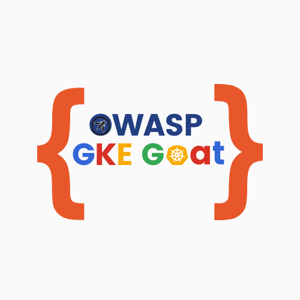

# OWASP GKE Goat 

  

  <b>OWASP GKE Goat</b> 
  An intentionally vulnerable GKE cluster designed for hands-on security testing and learning.

    Installation Guide Coming Soon at <b><a href="https://gkegoat.peachycloudsecurity.com">https://gkegoat.peachycloudsecurity.com</a></b>

    <!--  -->
    
    <a href="https://github.com/OWASP/www-project-gke-goat/releases/latest">
        <!--  -->
    </a>
    
    
    
    
    
    
    
    
  

---

  <b>Featured At</b>

  <i>Coming soon - Stay tuned for updates!</i>

  Made with  in India

## GKE Goat Now an Official OWASP Project! 

>  **GKE Goat** is now an official **OWASP project**! This marks a significant milestone in our journey to improve Kubernetes security education.

🔗 **Check out the OWASP page:** [OWASP GKE Goat](https://owasp.org/www-project-gke-goat/)  

## Overview

GKE Goat is an open-source, intentionally vulnerable Google Kubernetes Engine (GKE) cluster. It is built as a hands-on lab to explore real-world **security for cloud-managed Kubernetes on Google Cloud Platform (GCP), specifically using GKE**.

> ⚠️ **Note:** GKE Goat does not exploit any vulnerability in Google Cloud Platform (GCP) or GKE itself. All scenarios demonstrate misconfigurations with overly permissive privileges introduced by users under the shared responsibility model. The project is designed to help identify, audit, and remediate such real-world misconfigurations.

With GKE Goat, you'll get to:

*   **Reproduce Real-World Scenarios:** Directly experience common GKE misconfigurations and Google Cloud IAM pitfalls.
*   **Simulate End-to-End Attack Chains:** Walk through realistic attacks on cloud-managed Kubernetes, from a vulnerable web app all the way to a full GKE cluster takeover.
*   **Build Defensive Expertise:** Learn to implement effective hardening measures and validate your team's detection and response capabilities against real-world cloud-native threats.
*   **Unpack the Security Flow:** Understand the entire lifecycle of an attack, from initial web app compromise to exploiting Google Container Registry (GCR) and ultimately taking control of the GKE cluster.

This isn’t a read-only guide or sandbox demo. It’s a working, breakable GKE lab cluster to explore and improve real-world cloud security.

## Real-World Scenarios

Dive into a series of captivating scenarios that will challenge your security skills and deepen your understanding of GKE vulnerabilities:

**Part 1: Basic GKE Exploitation (Within Cluster)**
*   **Exploiting Next.js Application:** Uncover critical vulnerability (CVE-2025-55182 RCE) in Next.js application deployed in GKE.
*   **Post-Exploitation from Next.js RCE:** Leverage initial compromise to establish persistence and explore the cluster environment.
*   **Privilege Escalation via Overly Permissive RBAC:** Exploit misconfigured Kubernetes Service Accounts and RBAC policies for lateral movement and privilege escalation within the cluster.
*   **Pod-to-Node Breakout via GCE Metadata:** Achieve a pod-to-node breakout by abusing the Google Compute Engine (GCE) Metadata Service.
*   **Artifact Registry Exploitation & Docker Layer Secrets:** Learn and extract secrets from Google Artifact Registry by analyzing misconfigured Docker layers.
*   **Data Exfiltration from GCS Buckets:** Demonstrate exfiltration from Google Cloud Storage (GCS) buckets due to overly permissive node permissions.

**Part 2: GKE to GCP Escalation**
*   **GCP Permission Enumeration & Exploitation:** Enumerate and exploit GCP IAM permissions from compromised GKE workloads.
*   **Artifact Registry Exploitation by Image Backdooring:** Backdoor container images in Artifact Registry to establish persistence and compromise future deployments.
*   **Container to Host Breakout:** Escalate from container to underlying GCE node host.
*   **Kubelet Exploitation:** Exploit misconfigured Kubelet to gain unauthorized access to cluster resources.

## Prerequisites 

> Note: Running this lab on Google Cloud GKE will incur costs.
  >   For a typical session (~16 hours), the estimated cost is around $5–8 USD.

* GitHub Codespace
* Individual GCP account per participant with admin access and billing enabled (one GKE cluster per GCP project)
- Laptop with an updated browser (Administrative privileges may be required).

## Lab Documentation

>  Setup and installation documentation is available. Full walkthrough and detailed attack scenarios are not included in the public release.

* Installation Guide Coming Soon: [https://gkegoat.peachycloudsecurity.com](https://gkegoat.peachycloudsecurity.com)
 

* Alternate Link
  * In case of accessibility issues, use:  
_Coming soon_

#### GCP GKE Exploitation

* Deploying Vulnerable GKE Infrastructure
* Metadata Service Abuse to Steal Credentials
* Web App Exploitation to GCP IAM Compromise
* Container Registry to GKE Cluster Compromise
* Pod-to-Node Breakout in GKE
* Privilege Escalation to Cloud Storage Access and Data Exfiltration
* GCE Instance Cleanup Post Exploit

#### Environment Lifecycle

* Infra Spin-up for Vulnerable GKE Cluster
* Complete Infra Teardown Lab

## Disclaimer

- The information, commands, and demonstrations presented in this lab, including any course, are intended strictly for educational purposes. Under no circumstances should they be used to compromise or attack any system outside the boundaries of this educational session unless explicit permission has been granted.

    - **This course is provided by the instructors independently and is not endorsed by their employers or any other corporate entity. The content does not necessarily reflect the views or policies of any company or professional organization associated with the instructors.**

- **Usage of Training Material**: The training material is provided without warranties or guarantees. Participants are responsible for applying the techniques or methods discussed during the training. The trainers and their respective employers or affiliated companies are not liable for any misuse or misapplication of the information provided.

- **Liability**: The trainers, their employers, and any affiliated companies are not responsible for any direct, indirect, incidental, or consequential damages arising from the use of the information provided in this course. No responsibility is assumed for any injury or damage to persons, property, or systems as a result of using or operating any methods, products, instructions, or ideas discussed during the training.

- **Intellectual Property**: This course and all accompanying materials, including slides, worksheets, and documentation, are the intellectual property of the trainers. They are shared under the GPL-3.0 license, which requires that appropriate credit be given to the trainers whenever the materials are used, modified, or redistributed.

- **Educational Purpose**: This lab is for educational purposes only. Do not attack or test any website or network without proper authorization. The trainers are not liable or responsible for any misuse.
- **Usage Rights**: Individuals are permitted to use this course for instructional purposes, provided that no fees are charged to the students. 

- Logo colors are inspired by Material Design palette and do not represent affiliation with Google or Google Cloud: Cloud Computing Services.

> Note: Currently unable to provide the support in case facing any deployment issue. This lab is for educational purposes only. Do not attack or test any website or network without proper authorization. The trainers are not liable or responsible for any misuse and this course provided independently and is not endorsed by their employers or any other corporate entity. Refer to disclaimer section at [gkegoat.peachycloudsecurity.com](https://gkegoat.peachycloudsecurity.com/welcome/introduction#disclaimer)

## Support the Project

Your support helps us maintain and improve OWASP GKE Goat, create more educational content, and continue building open-source security resources for the community.

**Ways to Support:**
- **Star this repository** - Help others discover the project
- **Report issues** - Help us improve by reporting bugs or suggesting features
- **Contribute** - Submit PRs, improve documentation, or add new scenarios
- **Sponsor via GitHub** - [GitHub Sponsors](https://github.com/sponsors/peachycloudsecurity)
- **Explore Learning Resources** - Access additional tutorials, walkthroughs, and hands-on labs at [peachycloudsecurity.com](https://peachycloudsecurity.com)
- **Connect & Learn** - Join our community for cloud security discussions and resources via [Linktree](https://linktr.ee/peachycloudsecurity)

> **Looking for personalized guidance?** Get one-on-one mentorship, interview prep, or custom training sessions through our [Topmate](https://topmate.io/peachycloudsecurity) platform.

## Community

### A Container Security Village Initiative | Now Part of OWASP !
 -  **OWASP Project Page:** [OWASP GKE Goat](https://owasp.org/www-project-gke-goat/)  
 - **Container Security Village:** [LinkedIn](https://www.linkedin.com/company/containersecurityvillage/)
 - **Additional Learning Resources:** Explore multi-cloud security tutorials, hands-on labs, and educational content covering GCP, AWS, Kubernetes, and DevSecOps at [peachycloudsecurity.com](https://peachycloudsecurity.com)

## Credits 

> Acknowledging the great work that helped shape GKE Goat. Reach out if we missed anyone!

- [Ingress-Nginx CVE-2025-1974 - Vulhub](https://github.com/vulhub/vulhub/tree/master/ingress-nginx/CVE-2025-1974)
- [Next.js CVE-2025-55182 RCE - Vulhub](https://github.com/vulhub/vulhub/tree/master/nextjs/CVE-2025-55182)
- [Kubernetes Architecture](https://kubernetes.io/docs/concepts/architecture/)
- [CVE-2025-1974 PoC by yoshino-s](https://github.com/yoshino-s/CVE-2025-1974/tree/main)
- [IngressNightmare-POCs by sandumjacob](https://github.com/sandumjacob/IngressNightmare-POCs)
- [IngressNightmare-PoC by hakaioffsec](https://github.com/hakaioffsec/IngressNightmare-PoC)
- [The Unofficial GKE Security Guide](https://gkesecurity.guide/)
- [Tigera: GKE Security: The Basics and 10 Critical Best Practices](https://www.tigera.io/learn/guides/kubernetes-security/gke-security/)
- [CAST AI: GKE Security: Top 10 Strategies for Securing Your Cluster](https://cast.ai/blog/gke-security-top-10-strategies-for-securing-your-cluster/)
- [Wiz.io Academy: GKE Security Best Practices](https://www.wiz.io/academy/gke-security-best-practices)
- [Google Kubernetes Engine (GKE) Documentation](https://cloud.google.com/kubernetes-engine/docs)
- [Google Cloud Security Best Practices](https://cloud.google.com/security/best-practices)
- [Google Cloud IAM Best Practices](https://cloud.google.com/iam/docs/best-practices)
- [OWASP EKS Goat](https://github.com/OWASP/www-project-eks-goat)
- [dockerscan by cr0hn](https://github.com/cr0hn/dockerscan)
- [ChatGPT / Gemini - For Re-phrasing, Fixing & Re-writing] 
- [Acloudguru GCP sandbox](https://app.pluralsight.com/hands-on/playground/cloud-sandboxes)
- [raesene.github.io](https://raesene.github.io/blog/2024/11/11/When-Is-Read-Only-Not-Read-Only/)
- [BishopFox/badPods](https://github.com/BishopFox/badPods)
- [Kubernetes Goat](https://madhuakula.com/kubernetes-goat/docs/owasp-kubernetes-top-ten/)

> Special mention to [vulhub](https://github.com/vulhub) and the open-source security community for their invaluable contributions.

PS: Kubernetes® is a registered trademark of The Linux Foundation. Also, this is not exploiting GKE zeroday. It focuses on attacking and defending misconfigured GKE.
